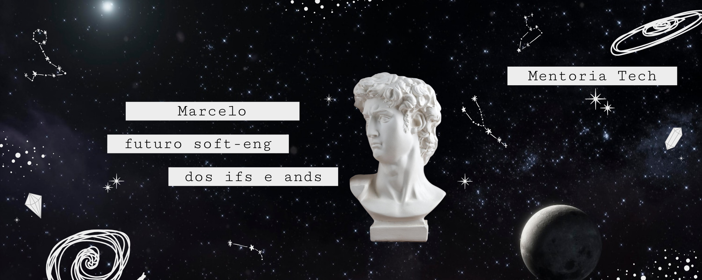

# Python Lab - Mentoria Tech



## 🚀 Sobre o Projeto

Este repositório é um **laboratório de estudos de Python**

## 🎯 Objetivo

O objetivo deste repositório é servir como um espaço prático para:
- 🐍 Explorar conceitos fundamentais e avançados de Python
- 💻 Desenvolver projetos práticos e exercícios
- 📚 Documentar o progresso e aprendizados
- 🔧 Experimentar com diferentes bibliotecas e frameworks
- 🧪 Testar e validar conhecimentos adquiridos

## 📋 Estrutura do Projeto

```
python-lab/
├── fundamentos/          # Conceitos básicos de Python
├── estruturas-dados/     # Listas, dicionários, tuplas, etc.
├── poo/                  # Programação Orientada a Objetos
├── modulos-pacotes/      # Organização de código
├── testes/               # Testes unitários e TDD
├── projetos/             # Projetos práticos
└── desafios/             # Exercícios e desafios
```

## 🛠️ Tecnologias

- **Python 3.x**
- **Git/GitHub** para versionamento
- **VS Code** como IDE principal
- Bibliotecas e frameworks conforme necessidade dos projetos

## 📚 Tópicos de Estudo

### Fundamentos
- [ ] Variáveis e tipos de dados
- [ ] Estruturas de controle (if/else, loops)
- [ ] Funções e escopo
- [ ] Tratamento de exceções

### Intermediário
- [ ] Programação Orientada a Objetos
- [ ] Módulos e pacotes
- [ ] Decoradores
- [ ] Geradores e iteradores

### Avançado
- [ ] Async/Await
- [ ] Design Patterns
- [ ] Testes automatizados
- [ ] Clean Code e boas práticas

## 🚀 Como Usar

1. Clone o repositório:
```bash
git clone https://github.com/[seu-usuario]/python-lab.git
cd python-lab
```

2. Crie um ambiente virtual:
```bash
python -m venv venv
source venv/bin/activate  # No Windows: venv\Scripts\activate
```

3. Instale as dependências (quando houver):
```bash
pip install -r requirements.txt
```

## 📝 Progresso da Mentoria

Aqui documentaremos marcos importantes e conquistas ao longo da jornada:

- **[Data]** - Início da mentoria
- **[Data]** - Primeiro projeto concluído
- _Em andamento..._

## 🤝 Mentoria

**Mentor(a):** Aline Marques  
**Mentorado:** Marcelo - Futuro Engenheiro de Software

> "Dos ifs e ands, construímos o futuro!" 🌟

## 📞 Contato

Para dúvidas ou sugestões sobre a mentoria, entre em contato através do GitHub.

---

<p align="center">
  Feito com ❤️ durante a Mentoria Tech
</p> 